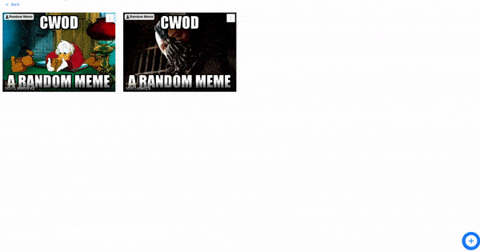

#XMeme

This project is a developed for CWoD. For more details visit ***[`https://crio.do`](https://crio.do)*** 

####View this project live on  
Frontend ***[https://xmeme-front.netlify.app](https://xmeme-front.netlify.app)***  
Backend ***[https://xmeme-back.herokuapp.com](https://xmeme-back.herokuapp.com)*** 
Swagger-UI ***[https://xmeme-back.herokuapp.com/swagger-ui](https://xmeme-back.herokuapp.com/swagger-ui)*** 

##### It can be used to :
    1. View Memes.
    2. Add a Meme.
    3. Update a Meme.
    4. Share a meme.
<i>This project also has SSE, so as soon as a new meme is added by someone the user will be notified.</i>
 

##### Here is the GIF of the Memes page

 
----

## How to use this project
Clone this repository and open the terminal from root project directory.
Follow the steps mentioned below according to your need.

##### Run the frontend
* Run `cd frontend` to get into the client application.
* Run *`npm i`* to install all the dependencies.
* Now run `npm start`. It'll start the server on [http://localhost:3000](http://localhost:3000).

##### Run the backend
* Run `cd backend` to get into the server application.
* Run *`npm i`* to install all the dependencies.
* Now run `npm start`. It'll start the API server on [http://localhost:8081](http://localhost:8081) and Swagger-UI at [http://localhost:8080/swagger-ui](http://localhost:8080/swagger-ui).
* Test API server by a get request to [http://localhost:8081/ping](http://localhost:8081/ping)